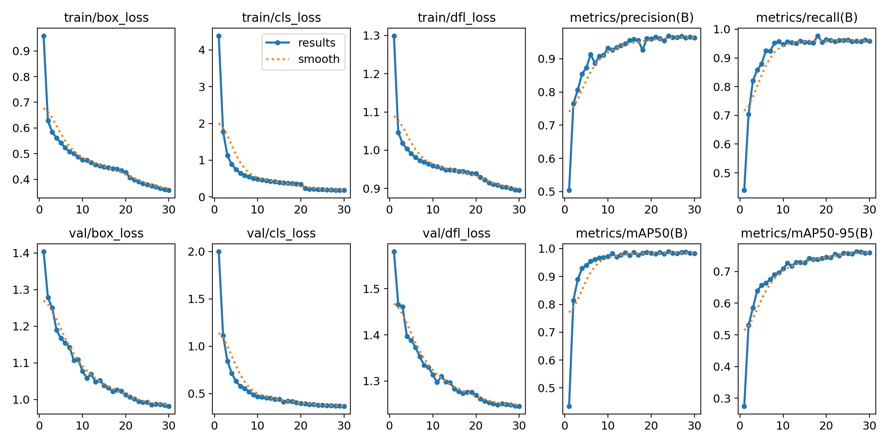

# Sign Language Detection with YOLOv8

## Authors
- @JoseMaese
- @Santiago Moreno Ordoñez

## Overview
This project, named "Sign Language Detection with YOLOv8," utilizes a Raspberry Pi equipped with a webcam and a Sense HAT module to detect sign language gestures. The detected signs are displayed on the Sense HAT LED matrix and also vocalized through a Bluetooth-connected speaker.

## Prerequisites
Before running the project, ensure you have the following components and libraries installed:

- Raspberry Pi with Sense HAT module
- Webcam
- Bluetooth speaker
- OpenCV
- Ultralytics YOLOv8
- Python libraries: `sense-hat`, `pygame` (for sound), and other dependencies listed in the code.

## Setup
1. Clone the repository:
    ```bash
    git clone https://github.com/JoseMaese/Sign-Language-Detection-YOLO.git
    cd Sign-Language-Detection-YOLOv8
    ```

2. Install required dependencies:
    ```bash
    pip install -r requirements.txt
    ```

3. Download the YOLOv8 model weights (`SignLanguageModel003.pt`) and place them in the project directory.

4. Connect the Raspberry Pi to the webcam and Bluetooth speaker.

## Usage
Run the main script:
```bash
python sign_language_detection.py
```

## Training results
[](Images/graficas_sign_language.png)
[](Images/matriz.png)

